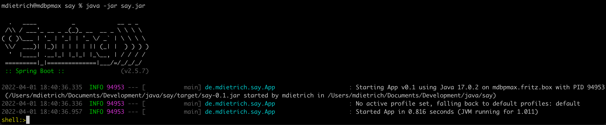
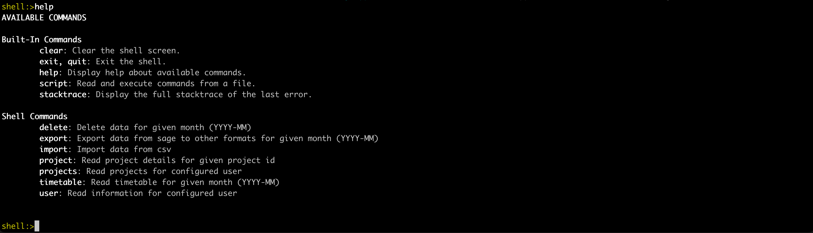
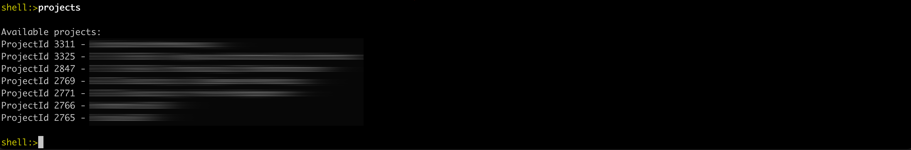
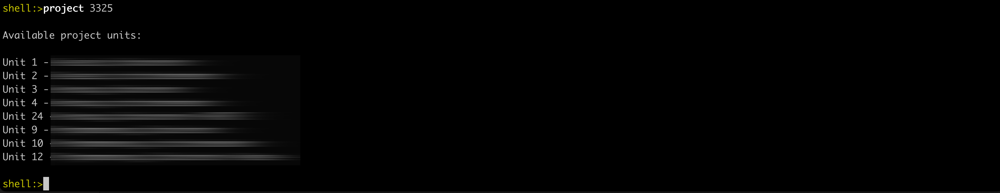
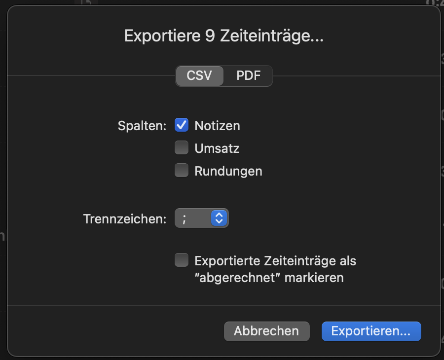
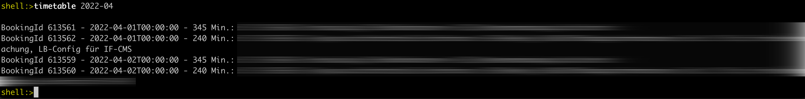
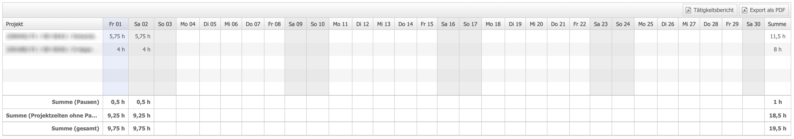
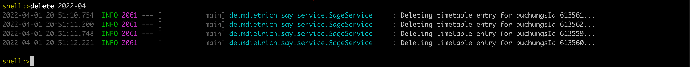

# SAY - Sage Automator Yak
[](https://mit-license.org/) 

<div align="center">
    <br />
	 <br />
    A Sage automator tool written in Java.
</div>


## About This Project

This project was created to reduce the effort of monthly time billing in combination with the Sage accounting software.

When working for different clients and projects on the same day, the easiest way for me to record time is via small tools in the menu bar (e.g. TimeMator). These tools typically allow the export of work data via CSV.

The little Yak performs the following tasks on the basis of such CSV data:

* Importing the working times from the CSV file into Sage
* Create end customer statements in PDF format from accounting data in Sage

When importing, the daily working times are aggregated for each project, linked to each other in terms of time and provided with break times.

The PDF statement is created for my specific case in the form of an XFA form.

## Getting Started

To get a local copy up and running follow these steps.

### Prerequisites

You need:

* Java Runtime Environment
* Apache Maven or
* A binary JAR of this project

### Installation

If you need to build this project on your own, clone this project, cd into it and run

```sh
mvn clean install
ln -s target/say-0.1.jar say.jar
```

If you have a binary jar file, you are ready to import CSV data right away. If the export of data is also to function, the folder structure [./export](export) with all subfolders from this repository is required.

### Configuration

The cloned project folder includes a [example_config.json](./example_config.json) file you should copy to `config.json` and change to your needs:

**config.json**

Parameter | Meaning
--- | ---
server | URL of your Sage server
username | Sage username
password | Sage password
firstname | Your firstname
lastname | Your lastname
pauseStart | Time of day when your pause should start
pauseDuration | Usual pause duration
dailyHours | Your daily working hours
importer | Importer to use for "import" function. See "Import CSV"
projects | Your project configuraiton
exports | Configuraiton of your exports

**Projects configuration**

Each project has a name, which is composed of the name of the company and the project. The scheme for this is
`"COMPANY NAME - PROJECT NAME"`. It is important to assign these data correctly. After importing the CSV data, the system searches for these entries in the configuration.

Parameter | Meaning
--- | ---
projectId | ID of the project in Sage. See below how to find these IDs
activityId | ID of the activity in Sage. See below how to find these IDs
defaultDescription | This description is set, when no description is found in the CSV for that project during a day
export | Name of the export (see below) to use for that project
addBreak | This is true by default. If set to false, no break will be added for that project. This is useful for sparetime or holiday-Projects

**Exports configuration**

Parameter | Meaning
--- | ---
type | Type of export mechanism to use.

All other parameters depend on the exporter used. Acutally there is only one supported exporter "FI_PDF" with the following additional parameters.

Parameter | Meaning
--- | ---
pdfIn | Name of the PDF to fill with xmlIn data, located in the folder export/in
xmlIn | Name of the base XML to fill into pdfIn, located in the folder export/in
bestellNr | Datafield to fill in typical source xml
bestellPos | Datafield to fill in typical source xml
warenkorbNr | Datafield to fill in typical source xml
kontierungsObjekt | Datafield to fill in typical source xml
kreditorenNr | Datafield to fill in typical source xml
leistungArt | Datafield to fill in typical source xml
leistungOrt | Datafield to fill in typical source xml
leistungEmpfaenger | Datafield to fill in typical source xml

## Usage

### Start The App

```sh
java -jar say.jar
```

You will see something like this:


The desired operations can then be carried out in the console.

You can leave the app with `exit` at any time


### Get Help

Get help about the available operations.

`help`




### Get User Information

After the initial configuration, it is a good idea to check that the basics are working.

With this command you can check whether the login works with the configured access data.

`user`


### Get Project Information

Reads the projects currently available for the user.

The values from the `projectId` fields of the `config.json` file must be present in this list. For the initial configuration, the values for the projects can be taken from this list. The IDs visible in the Sage frontend differ from these.

`projects`



### Get Project Details

This reads detail information for a given project ID.
The values from the `activityId` fields of the `config.json` file must be present in this list. For the initial configuration, the values for the activities can be taken from this list. The IDs visible in the Sage frontend differ from these.

`project [projectId]`



### Import CSV

This imports the given CSV file into Sage. Yak automatically removes unnecessary entries and adds new ones.

`import [filename]`


Über den "importer"-Konfigurationseintrag kann zwischen folgenden Importern gewählt werden:
- simpleCsvImporter
- timematorCsvImporter

The following importers can be selected via the "importer" configuration entry:
- simpleCsvImporter
- timematorCsvImporter

The **simpleCsvImporter** uses a simple structure to import the values. Details can be found in the example file "example_simple.csv".

The **timematorCsvImporter** uses the CSV export structure including notes:

<div align="left">
    <br />
	 <br />
    A Sage automator tool written in Java.
</div>

Details can be found in the example file "example_timemator.csv".


### Read Timetable From Sage

Reads the timetable for a given month from Sage. Provide the month in the format YYYY-MM.

`timetable [month]`



After the import the results can be seen in the Sage frontend.




### Export Timetable From Sage

Exports a timetable from Sage for a given month. Provide the month in the format YYYY-MM.

`export [month]`


The files created can be found under [./export/out](export/out).

### Delete Timetable From Sage

If something went wrong and you want to start over, you can delete all entries for a given month. Provide the month in the format YYYY-MM.

`delete [month]`



## Disclaimer

Use this tool at your own risk. Make sure that your data gets imported and exported correctly. I am not responsible for any wrong numbers in your accounting.

## License

Distributed under the MIT License. See LICENSE.txt for more information. However, additional restrictions may apply.

Photo of Yak by <a href="https://unsplash.com/@oladybul">Ola Dybul</a> on <a href="https://unsplash.com/">Unsplash</a>

## Contact

Mario Dietrich - [@mdietrich](https://twitter.com/mdietrich) - mdietrich@mdietrich.de

Project Link: https://github.com/mdietrich/say

